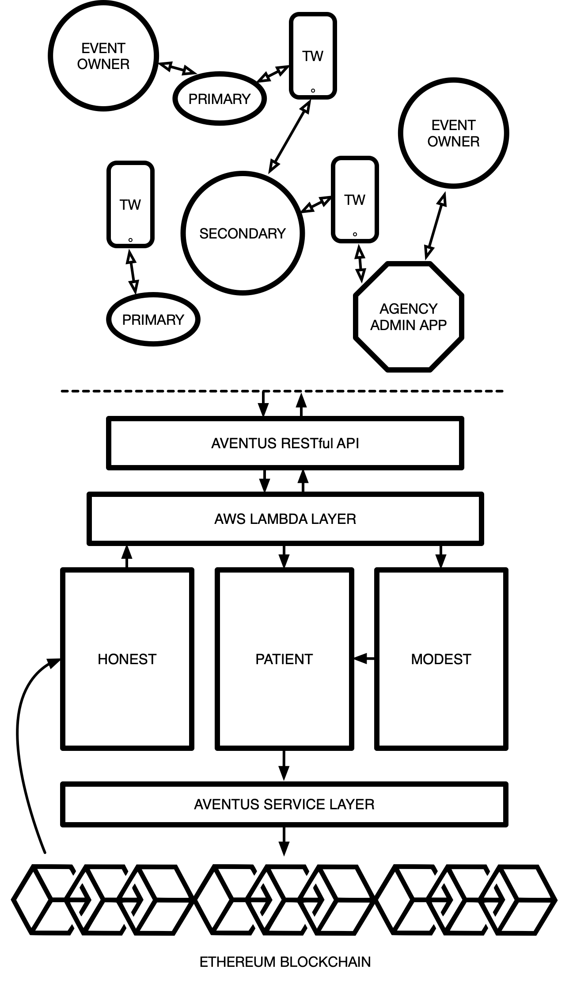

# Introduction

UGH

I can update from GH desktop, not atom. BUILD PLZ. Realy f'ing build plox.

I'm loosing the will to live. build ye bastard

Welcome, to your bridge to Blockchain; Artos. We have developed the Aventus Protocol on behalf of the Aventus Foundation.

You access the RESTful API by sending HTTPS requests to specific URLs (endpoints) on the QRadar® SIEM Console. To send these requests, use the HTTP implementation that is built in to the programming language of your choice. Each request contains authentication information, and parameters that modify the request.

Below you will find a general architecture diagram outlining our core services and where data is being processed from the point of entry via an endpoint. Each of these distinct products makes up the Artos ecosystem and we aim to continue to develop these as our implementation matures.



As shown in the above architecture diagram our technology stack is built in layers on top of the blockchain and each product serves a purpose to ensure interaction via our endpoints is standardised and familiar for developers

# Authentication

> To authorize, use this code:

```ruby
require 'kittn'

api = Kittn::APIClient.authorize!('meowmeowmeow')
```

```python
import kittn

api = kittn.authorize('meowmeowmeow')
```

```shell
# With shell, you can just pass the correct header with each request
curl "api_endpoint_here"
  -H "Authorization: meowmeowmeow"
```

```javascript
const kittn = require('kittn');

let api = kittn.authorize('meowmeowmeow');
```

> Make sure to replace `meowmeowmeow` with your API key.

Kittn uses API keys to allow access to the API. You can register a new Kittn API key at our [developer portal](http://example.com/developers).

Kittn expects for the API key to be included in all API requests to the server in a header that looks like the following:

`Authorization: meowmeowmeow`

<aside class="notice">
You must replace <code>meowmeowmeow</code> with your personal API key.
</aside>

# Before You Begin
This guide acts as developer reference for integrating with Aventus Protocol RESTful API covering interaction with events and tickets hence any language and instructional information assumes an existing technical knowledge of interacting via an API and the typical practices involved.

By sending HTTPS requests to specific URLs (endpoints) as a registered user you can easily harness the power of the Aventus Protocol allowing us to handle any corresponding complexity with writing and reading the Ethereum blockchain.

An API endpoint contains the URL of the resource that you want to access and the action that you want to complete on that resource. The action is indicated by the HTTP method of the request: GET, POST, PUT, or DELETE.

When you send an API request, the server returns an HTTP response. The HTTP response contains a status code to indicate whether the request succeeded and the details of the response in the response body. Most resources format this response as JavaScript Object Notation (JSON). You can use the JSON packages or libraries that are built in to the programming language that you use to extract the data.

## Getting Started
<!--- I suppose we should tell people how to build a testing environment on their own machine, step by step? --->
If this is your first time here, scan this section before digging deeper into the documentation. The sections after this page assume you know the basics about the Aventus Protocol. For further information, read our Whitepaper here.

What you can do?
- Create an Event (POST)
- Retrieve Event List (GET)
- Delete Event (DELETE)
- Create Tickets (POST)
- Retrieve Ticket List (GET)
- Cancel Tickets (DELETE)
- Send Ticket Links (POST)
- Generate Doorlist (GET)

<!--- Differences between development environment and live?

=============
The exact things we're looking to do are...

> HOW DO I SET UP AN EVENT (focus: setup)
> HOW DO I ENSURE TICKETS ARE CONTAINED IN THIS
> HOW DO I PUT THOSE TICKETS ON SALE
> REMEMBER THAT THIS IS MODEST BY DEFAULT
==============
-->

# The Ecosystem

<!---
What are these things doing, why, are they relevant to me
Although users won't be accessing these services directly, this is a top level overview of what are the parts of the architecture diagram and what it means to them

Either specific pages, or single overview page...
--->

- **Aventus Protocol**
 - The Aventus Protocol is a global open standard for the exchange of tickets built upon the Ethereum blockchain composed of smart contracts that allow for the creation and validation of events, the issuance, sale and distribution of tickets in primary and secondary ticket markets (under parameters designed and customised by inventory holders and event organisers) and the allocation of defined proportions of ticket sale revenue between event organisers, ticket promoters, artists, secondary resellers, etc.
- _Virtue Services_
   - **Patient** is a queuing system. A way to manage a large requests that will write to the blockchain. Think of the IMS that sends large amounts of requests to the blockchain, but the blockchain itself is really slow. Patient manages (i.e. queues) the transactions that are being sent to the blockchain. A user of Patient doesn’t need to know how to interact with the protocol as it operates as a high level layer between the protocol and the client. Patient users also don’t need to care about smart contracts, transaction fee’s etc. It auto adjusts the price paid for gas depending on the level of congestion on the blockchain.
   - **Honest** is a public API that allows any kind of application to look up information on the protocol. Anything that resides on the protocol can be seen and consumed by Honest.
   - **Modest** The last, and largest of our virtue services. Modest, as the name suggests, is our scaling solution for the blockchain, but firstly for the Aventus Protocol itself. It utilises Merkle trees to allow much quicker, concurrent processing of objects to the blockchain.
- **AWS Lambdas**
   - We employ the use of AWS Lambdas throughout the technology stack as serverless middleware between services. These aren't distinct services themselves but simply allow for horizontally scalable data processing throughout the system.
- **Ticket Wallet**
   - The Aventus Ticket Wallet is a white-label mobile application acting as the user facing client for loading and viewing tickets issued by the event creator. Originally designed as a proof-of-concept to show our end-to-end solution including access control but is built in a modular fashion to allow third parties to brand their own wallet using our technology under the hood.

# Guides
Aventus makes creating and managing events and tickets on the blockchain easy. Find the documentation, sample code, and developer tools you need to build exactly what you want, fast. We’ll handle the complexity of blockchain and the Aventus Protocol. Let’s get building!

## Create Event
The first thing we'd recommend you do is create an event. Events are the foundation of any content on the Aventus Protocol and must be in place before tickets can be issued and thus comes first in this guided flow.

Using our Aventus RESTful API, you can create events on the protocol direct from your language of choice. In this guide, we'll explore how you can use the Aventus API to:
  - Create a new event
  - Set parameters for your event

First, take note of the method, and sample request. In this example guide you'll be creating your new event for 8000 people.

## Retrieve Event List
Now that you have created an event you may want to retrieve these details from the protocol in order to keep track of your live events.

Using our Aventus RESTful API, you can query for a list of active events from your language of choice. In this guide, we'll explore how you can use the Aventus API to:
- See a list of active events

First, take note of the method, and sample request. In this example guide you'll be retrieving the details of an event recently created.

## Delete Event
Now that you have created an event you may want to cancel it if there was an error.

Using our Aventus RESTful API, you can cancel an event you created from your language of choice. In this guide, we'll explore how you can use the Aventus API to:
- Cancel an event

First, take note of the method, and sample request. In this example guide you'll be cancelling an event you recently created.

## Create Tickets
Now that you have created an event you can now generate and distribute tickets to customers

Using our Aventus RESTful API, you can create new tickets for an event you created from your language of choice. In this guide, we'll explore how you can use the Aventus API to:
- Generate new tickets
- Distribute tickets via email

First, take note of the method, and sample request. In this example guide you'll be cancelling an event you recently created.

## Retrieve Ticket List
Now that you have created an event with tickets you can now retrieve a list of tickets associated with an event and see the status of each ticket

Using our Aventus RESTful API, you can fetch a list of tickets for an event you created from your language of choice. In this guide, we'll explore how you can use the Aventus API to:
- Fetch a list of tickets

First, take note of the method, and sample request. In this example guide you'll be cancelling an event you recently created.

## Cancel Tickets
Now that you have a list of tickets for an event, you can now perform ticket management and cancel a specific ticket

Using our Aventus RESTful API, you can specify a ticket to cancel from your language of choice. In this guide, we'll explore how you can use the Aventus API to:
- Cancel a ticket

First, take note of the method, and sample request. In this example guide you'll be cancelling an event you recently created.

<!--- KEEP THE FUCKING KITTENS -AH --->

# Kittens

## Get All Kittens

```ruby
require 'kittn'

api = Kittn::APIClient.authorize!('meowmeowmeow')
api.kittens.get
```

```python
import kittn

api = kittn.authorize('meowmeowmeow')
api.kittens.get()
```

```shell
curl "http://example.com/api/kittens"
  -H "Authorization: meowmeowmeow"
```

```javascript
const kittn = require('kittn');

let api = kittn.authorize('meowmeowmeow');
let kittens = api.kittens.get();
```

> The above command returns JSON structured like this:

```json
[
  {
    "id": 1,
    "name": "Fluffums",
    "breed": "calico",
    "fluffiness": 6,
    "cuteness": 7
  },
  {
    "id": 2,
    "name": "Max",
    "breed": "unknown",
    "fluffiness": 5,
    "cuteness": 10
  }
]
```

This endpoint retrieves all kittens.

### HTTP Request

`GET http://example.com/api/kittens`

### Query Parameters

Parameter | Default | Description
--------- | ------- | -----------
include_cats | false | If set to true, the result will also include cats.
available | true | If set to false, the result will include kittens that have already been adopted.

<aside class="success">
Remember — a happy kitten is an authenticated kitten!
</aside>

## Get a Specific Kitten

```ruby
require 'kittn'

api = Kittn::APIClient.authorize!('meowmeowmeow')
api.kittens.get(2)
```

```python
import kittn

api = kittn.authorize('meowmeowmeow')
api.kittens.get(2)
```

```shell
curl "http://example.com/api/kittens/2"
  -H "Authorization: meowmeowmeow"
```

```javascript
const kittn = require('kittn');

let api = kittn.authorize('meowmeowmeow');
let max = api.kittens.get(2);
```

> The above command returns JSON structured like this:

```json
{
  "id": 2,
  "name": "Max",
  "breed": "unknown",
  "fluffiness": 5,
  "cuteness": 10
}
```

This endpoint retrieves a specific kitten.

<aside class="warning">Inside HTML code blocks like this one, you can't use Markdown, so use <code>&lt;code&gt;</code> blocks to denote code.</aside>

### HTTP Request

`GET http://example.com/kittens/<ID>`

### URL Parameters

Parameter | Description
--------- | -----------
ID | The ID of the kitten to retrieve

## Delete a Specific Kitten

```ruby
require 'kittn'

api = Kittn::APIClient.authorize!('meowmeowmeow')
api.kittens.delete(2)
```

```python
import kittn

api = kittn.authorize('meowmeowmeow')
api.kittens.delete(2)
```

```shell
curl "http://example.com/api/kittens/2"
  -X DELETE
  -H "Authorization: meowmeowmeow"
```

```javascript
const kittn = require('kittn');

let api = kittn.authorize('meowmeowmeow');
let max = api.kittens.delete(2);
```

> The above command returns JSON structured like this:

```json
{
  "id": 2,
  "deleted" : ":("
}
```

This endpoint deletes a specific kitten.

### HTTP Request

`DELETE http://example.com/kittens/<ID>`

### URL Parameters

Parameter | Description
--------- | -----------
ID | The ID of the kitten to delete
