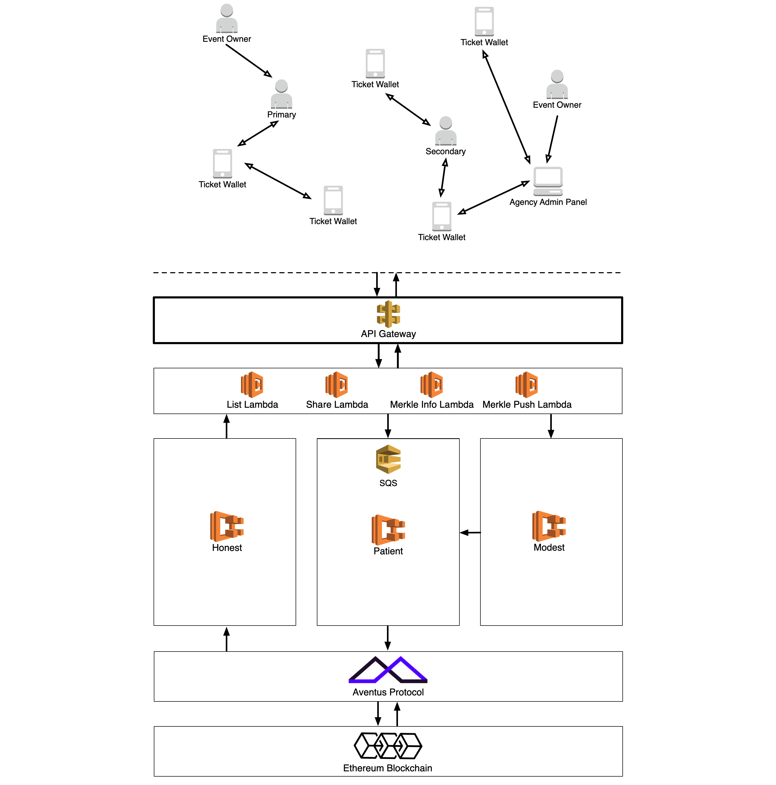

# Introduction

We have developed the Aventus Protocol on behalf of the Aventus Foundation.

Below you will find a general architecture diagram outlining our core services and where data is being processed from the point of entry via our RESTful API. Each of these distinct services makes up the Artos Systems ecosystem and we aim to continue to develop these as our implementation matures.



As shown in the above architecture diagram our technology stack is built in layers on top of the Ethereum blockchain and each product serves a purpose to ensure interaction via our endpoints is standardised and familiar for developers.

### Aventus Protocol

The Aventus Protocol is a global open standard for the exchange of tickets built upon the blockchain composed of smart contracts that allow for the creation and validation of events, the issuance and distribution of tickets in primary and secondary ticket markets. For more information, please refer to our [Whitepaper](https://aventus.io/doc/whitepaper.pdf) - or for a shorter read, our [Lightpaper](https://aventus.io/doc/lightpaper.pdf).

### Protocol Abstraction

Something of the blockchain are hard to deal with. We developed a family of services that help deal with the inherent challenges working with the blockchain provides.

**Patient** is a queuing system. A way to manage a large requests that will write to the blockchain. Think of the theortical ticket distribution systems that sends large amounts of requests to the blockchain, but the blockchain itself is really slow. Patient manages (i.e. queues) the transactions that are being sent to the blockchain. A user of Patient doesn’t need to know how to interact with the protocol as it operates as a high level layer between the protocol and the client. Patient users also don’t need to care about smart contracts, transaction fee’s etc. It auto adjusts the price paid for gas depending on the level of congestion on the blockchain.

**Honest** is a public API that allows any kind of application to look up information on the protocol. Anything that resides on the protocol can be seen and consumed by Honest.

**Modest** is our scaling solution for the blockchain, but firstly for the Aventus Protocol itself. It utilises Merkle trees to allow much quicker, concurrent processing of objects to the blockchain.

<aside class="notice">In the future we will add a specification for Modest here, and also a deeper explanation of how it works and how you can roll your own solution.</aside>

#### AWS Lambdas

We employ the use of AWS Lambdas throughout the technology stack as serverless middleware between services. These aren't distinct services themselves but simply allow for horizontally scalable data processing throughout the system.

### API Gateways

The core product you will be interacting with. A RESTful inteface to give you easy interaction with the protocol. For more, see below.

### SDKs

Including, but not exhaustive: Aventus4S - our Scala library for interacting with the protocol, and AventusJS - our Javascript library for interacting with the protocol. As we develop more SDKs, we will insert them here and in the relevant sub section.

### B2B/B2C Applications

#### White-Label Ticket Wallet

The Aventus Ticket Wallet is a white-label mobile application acting as the user facing client for loading and viewing tickets issued by the event creator. Originally designed as a proof-of-concept to show our end-to-end solution including access control but is built in a modular fashion to allow third parties to brand their own wallet using our technology under the hood.

<!--- Ermmmm??? This API documentation aims to make interacting the the Aventus Protocol as simple and straightforward as possible. --->

#### Ticket Wallet Modules

As we will elaborate on further down this documentation, the Ticket Wallet has been built in a modular fashion. As such, our white label solution _doesn't need_ to be the starting point of integrating our tickets with your application. In the section concerning the Ticket Wallet Modules specifically, we will list the options available for you.

#### METaL App

METaL is our protocol level interface for clients to create and manage events that will be delivered with the assistance of the Aventus Protocol. It enables users to create events and tickets with relevant CRUD functions. Further detail is provided later in this document.

# Before You Begin

This guide acts as developer reference for integrating with Aventus Protocol RESTful API covering interaction with events and tickets hence any language and instructional information assumes an existing technical knowledge of interacting via an API and the typical practices involved.

By sending HTTPS requests to specific URLs (endpoints) as a registered user you can easily harness the power of the Aventus Protocol allowing us to handle any corresponding complexity with writing and reading the Ethereum blockchain.

An API endpoint contains the URL of the resource that you want to access and the action that you want to complete on that resource. The action is indicated by the HTTP method of the request: GET, POST, PUT, or DELETE.

When you send an API request, the server returns an HTTP response. The HTTP response contains a status code to indicate whether the request succeeded and the details of the response in the response body. Most resources format this response as JavaScript Object Notation (JSON). You can use the JSON packages or libraries that are built in to the programming language that you use to extract the data.

Finally, Sandboxing abilities will be added to this document as we move towards completing our <kbd>Enterprise Grade</kbd> epic during Quarter 1.

# Authentication

All requests to the Aventus APIs go over the web. Essentially this means that any system that can speak to the web, can speak to our APIs. Any and all language specific libraries and SDKs provided are really just wrappers which are providing some convenience and linguistic niceties to help you work with a simple, RESTful API.

Aventus will create an Auth0 login for you to use, and thereafter: the Aventus API requires a header authorisation key/value pair for each request.

> To authorize, use this code:


```shell
# With shell, you can just pass the correct header with each request
curl "api_endpoint_here"
  -H "Authorization: ticketticket"
```

> Make sure to replace `ticketticket` with your API key.

Aventus expects for the API key to be included in all API requests to the server in a header that looks like the following:

`Authorization: ticketticket`

<aside class="notice">
As of now, there is no need to authenticate. Please see this section in the future for authentication details.
</aside>

# Getting Started

If this is your first time here, scan this section before digging deeper into the documentation. The sections after this page assume you know the basics about the Aventus Protocol. For further information, read our Whitepaper [here](https://aventus.io/doc/whitepaper.pdf) or for a shorter read, our Lightpaper is [here](https://aventus.io/doc/lightpaper.pdf).

What you can do?

- Create an Event (POST)
- Retrieve Event List (GET)
- Create Tickets (POST)
- Retrieve Ticket List (GET)

# API Guides
Aventus makes creating and managing events and tickets on the blockchain easy. Find the documentation, sample code, and developer tools you need to build exactly what you want, fast. We’ll handle the complexity of blockchain and the Aventus Protocol. Let’s get building!

<aside class="warning">
**Please note**: As of now, these API endpoints and resources are a "Work In Progress". They will be updated as soon as possible to reflect the product as is. However, the guides themselves are relevant and correct.
</aside>

## Create Event
The first thing we'd recommend you do is create an event. Events are the foundation of any content on the Aventus Protocol and must be in place before tickets can be issued and thus comes first in this guided flow.

Using our Aventus RESTful API, you can create events on the protocol direct from your language of choice. Here, we'll explore how you can use the Aventus API to:

  - Create a new event
  - Set parameters for your event


### Method: `POST`

`POST /events`

> The following is an empty sample request

```json
{
	"eventDesc": "string",
	"eventSupportURL": "string",
	"onSaleTime": number,
	"offSaleTime": number,
}
```

### Request Headers

Parameter | Type | Description
--------- | ------- | -----------
eventDesc | string | A brief description of the event you are hosting, 200 characters maximum.
eventSupportURL | string | If your event has a supporting link, to say the event on the artist website, please place here..
onSaleTime | number | The time that tickets will go on sale. Seconds since Epoch.
offSaleTime | number |  The time that tickets will go off sale. Seconds since Epoch.


> The following sample request has inputs for a potential event

```json
[
  {
	"eventDesc": "Kendrick Lamar, Brixton Academy, London, 18+",
	"eventSupportURL": "www.kendricklamar.com/tour",
	"onSaleTime": 1574500752,
	"offSaleTime": 1573250035,
}
]
```

## Retrieve Event List
Query for a list of active events from your language of choice.

### Method: `GET`

`GET /events`

> Sample Response: The following is the expected response for asking for a list of active events

```json
[
  {
    "eventId": 1,
    "description": "Kendrick Lamar, Brixton Academy, London, 18+",
    "onSaleTime": 1574500752,
    "offSaleTime": 1573250035,
    "price": 1000,
    "avtDeposit": "1000"
  },
  {
    "eventId": 2,
    "description": "Beyonce, Wembley Stadium, London",
    "onSaleTime": 1542986560,
    "offSaleTime": 1574544160,
    "price": 1000,
    "avtDeposit": "1000"
  },
  {
    "eventId": 3,
    "description": "A Tribe Called Quest, The Apollo, Harlem",
    "onSaleTime": 1542991411430,
    "offSaleTime": 1542991415430,
    "price": 1000,
    "avtDeposit": "1000"
  },
]
```


## Ticket Definition

<!--- Suppp Eth. I thought about this for a while and really, I'm going to change the 'reference' section to 'Response Headers' as stylistically it makes sense because that's what I'm actually exaplining here. It'll read better, but then I need to do the same to the event section as we didn't to response headers either. Then I can go and crop for style. Brb, running. --->

> A Ticket to be consumed by the Ticket Wallet consists of

```
secret -> very_very_secret,
payload -> {\"eventName\": \"Stubborn Event\", \"eventTime\": 1543255200, \"eventVenue\": \"Hell\"},
ticketRef -> stubborn-4064,
eventId -> 1,
primarySignedSecret -> 0x7a4a1ade9fa66db3227574384fcd20dd244bed5ef36ed7fbab08e92f0ffa3e2949c1df37a5cf0f360bf500c72509f313238a2935158eb940753285505dfff25c00,
doublySignedSecret -> 0x655b1710acd74d630352bb25ad031d9803fdba094b3a921399300abbf85e95d83d3805b7b6057148f9134ce3ce52e3114614b15ab585b285fa45c7e55d99655000,
primarySignedTicketData -> 0xf126ffc2a84ed5bfec1a40a02be5af6fbddaee19796ae36feee1471c38aa6a80625cd3933a9739529c595e0544886cfbf0555f9d2a35a434f31f5dc963a8a37500,
customerSignedData -> 0x50256df6e9173f1396d018125936efa3b909df0831e7f55cbd59074d5f9616ad316054c658838dcc0286cb7dbb4d9057a7dddb69480d3f1cef19fe993e77327300
```

Before moving onto methods of interacting with tickets - a brief explainer on what a Ticket consists of.

The example provided is what the Ticket Wallet sends to our API.

### Response Headers

Parameter | Type | Description
--------- | ------- | -----------
secret  | string  | a unique identifier used to reference an event on the Aventus Protocol
payload  |  string | customer email address
ticketRef  | string  |
eventId  | string  |
primarySignedSecret  | string  |
doublySignedSecret  | string  |
primarySignedTicketData  | string  |
customerSignedData  | string  |

Anything that is `primarySigned` is coming from the link generator on completion of a ticket (through METaL). What has been signed by the customer (including `doublySignedSecret`) comes from the wallet.

**Customer Signed Data contains:**

`customerSignedData = sign(“$payload|$eventId|$ticketRef|${link.secret}|$secretSignature|$doublySignedSecret|$ticketDataSignature”, customerPrivateKey)`

**doublySignedSecret contains:**


`doublySignedSecret = sign(primarySecretSignature, customerPrivateKey)`


#### Reference

- **payload** = contextual, non-unqiue which is attached to a ticket. includes but not exclusive to: event name, data, time, location.
- **ticketRef** = unique identifier for a ticket


## Create Tickets
Create new tickets for an event you created from your language of choice.

### Method: `POST`

`POST /tickets`

> Sample Request: The following will create a number of tickets for a specific event

```json
{
  "eventId": "string",
  "email": "string",
}
```

### Request Headers

Parameter | Type | Description
--------- | ------- | -----------
eventId  | string  | a unique identifier used to reference an event on the Aventus Protocol
email  |  string | customer email address

> Sample Response: The following is the expected response for creating a number of tickets for a specific event

```json
[
  {
    "vendorReference": "ref 1543329264762",
    "eventId": "3",
    "payload": "payload",
    "email": "customer@aventus.io",
    "secret": "5b7e7593-ff70-4c57-b1da-565380f1e964",
    "link": "artos.ticketwallet://+?payload=W3siZXZlbnRJZCI6IjUiLCJ0aWNrZXRSZWZlcmVuY2UiOiJyZWYgMTU0MzMyOTI2NDc2MiIsInBheWxvYWQiOiJ7c29tZVN0dWZmV2hhdGV2ZXJGb3JtYXRQYXlsb2FkfSIsImRhdGFTaWduYXR1cmUiOiIweGI3ZTMxZWVjMjUzZDI2ZTIzZDQwNjg3Nzc0MjM5NDZmMmZjNDk1YjlhMWE5YmNlODk2ZDQ0ZWQyM2E5OGU5ZWMwNDNiNDc4OWYzN2UxYTEwMmMxOTQ2NzRlMzNhMzE0MjY4Y2U3NzJhMDdmODg3ZGZlMmQ3ZWNkZmQ5MDIwNjNjMDEiLCJzZWNyZXQiOiJNeSBhbWF6aW5nIHNlY3JldCIsInNlY3JldFNpZ25hdHVyZSI6IjB4YzY5MWUyMTdhOTZlNGVhZTQ5MDhmYzM4MjlmNGVmNDk0MDBlNDc1MGIxNzZmMWJiMDhlYWE3MjM2NTkzOTJjNDY3NTZhMGMzODQ0Yzk0NTEwZTkxNDdjYjllZDhiOWY0Yjc2MGJlZGM2YjZiNTJhOWM0MTMyMDA5ODAyNTk1YjMwMCJ9XQ==",
    "status": "status"
  }
]
```

### Response Headers

Parameter | Type | Description
--------- | ------- | -----------
vendorReference  | string  | a unique identifier used to reference a vendor on the Aventus Protocol
eventId  |  string | a unique identifier used to reference an event on the  Protocol
payload  | string  | contextual, non-unqiue data which is attached to a ticket. includes but not exclusive to: event name, data, time, location
email  | string  | customer email address
secret  | string  |
link  | string  | the link to be sent to a customer which will open in their  Ticket Wallet
status  | string  | <!--- erm -->

## Retrieve Ticket List
Retrieve a list of tickets associated with an event and see the status of each ticket


### Method: `GET`

`GET /events/*eventId*/tickets`

> Sample Response: The following is the expected response for retrieving a list of tickets for a specified event

```json
[
  {
    "vendorReference": "ref 1543005210191",
    "eventId": "3",
    "payload": "payload",
    "email": "customer2@aventus.io",
    "secret": "7b52931c-e1a9-4b7d-bf06-c2f0d9562d3a",
    "link": "artos.ticketwallet://+?payload=W3siZXZlbnRJZCI6IjUiLCJ0aWNrZXRSZWZlcmVuY2UiOiJyZWYgMTU0MzAwNTIxMDE5MSIsInBheWxvYWQiOiJ7c29tZVN0dWZmV2hhdGV2ZXJGb3JtYXRQYXlsb2FkfSIsImRhdGFTaWduYXR1cmUiOiIweDE2MGRlMjIzNDc1NmY0MWNlYzU1MDZmNGZjZWUxZTg3MTUzNmYwZmI3YWVlN2EyMDE4ZmJjODdjOWRhNzNiZmM3Zjg5ZDQ0MDA2ZDAzN2Y5YmEzZTc0NmIxNDIzMTJiNWU5Nzc1MTRkZDAwNjlhNDUwODdlNDRmZGY1Y2VhNmM2MDEiLCJzZWNyZXQiOiJNeSBhbWF6aW5nIHNlY3JldCIsInNlY3JldFNpZ25hdHVyZSI6IjB4YzY5MWUyMTdhOTZlNGVhZTQ5MDhmYzM4MjlmNGVmNDk0MDBlNDc1MGIxNzZmMWJiMDhlYWE3MjM2NTkzOTJjNDY3NTZhMGMzODQ0Yzk0NTEwZTkxNDdjYjllZDhiOWY0Yjc2MGJlZGM2YjZiNTJhOWM0MTMyMDA5ODAyNTk1YjMwMCJ9XQ==",
    "status": "status"
  },
  {
    "vendorReference": "ref 1542993837015",
    "eventId": "3",
    "payload": "payload",
    "email": "customer3@aventus.io",
    "secret": "cb80109a-22aa-41bf-9e28-eea721d5b4ab",
    "link": "artos.ticketwallet://+?payload=W3siZXZlbnRJZCI6IjUiLCJ0aWNrZXRSZWZlcmVuY2UiOiJyZWYgMTU0Mjk5MzgzNzAxNSIsInBheWxvYWQiOiJ7c29tZVN0dWZmV2hhdGV2ZXJGb3JtYXRQYXlsb2FkfSIsImRhdGFTaWduYXR1cmUiOiIweDRkM2FjZTAxNzY5NzhkYjczMjkyN2Y4MWY1OWYyZTQxYTMxNWRmOTAxOTI3OTgyZjE1OGE4MmEzNzY1ODBkNzA0MWFjNzY5NTJhZmMyMTc2OGNkZWJlNjFkMTk5ZGI2M2Y2YzE5OGI1ZDJmMTc4ZmE5OGQ0NzlhODIyMmJiZGYxMDAiLCJzZWNyZXQiOiJNeSBhbWF6aW5nIHNlY3JldCIsInNlY3JldFNpZ25hdHVyZSI6IjB4YzY5MWUyMTdhOTZlNGVhZTQ5MDhmYzM4MjlmNGVmNDk0MDBlNDc1MGIxNzZmMWJiMDhlYWE3MjM2NTkzOTJjNDY3NTZhMGMzODQ0Yzk0NTEwZTkxNDdjYjllZDhiOWY0Yjc2MGJlZGM2YjZiNTJhOWM0MTMyMDA5ODAyNTk1YjMwMCJ9XQ==",
    "status": "status"
  },
  {
    "vendorReference": "ref 1542993841495",
    "eventId": "3",
    "payload": "payload",
    "email": "customer4@aventus.io",
    "secret": "9f7ab0e5-7d7d-4ab4-a142-faa2c2df1399",
    "link": "artos.ticketwallet://+?payload=W3siZXZlbnRJZCI6IjUiLCJ0aWNrZXRSZWZlcmVuY2UiOiJyZWYgMTU0Mjk5Mzg0MTQ5NSIsInBheWxvYWQiOiJ7c29tZVN0dWZmV2hhdGV2ZXJGb3JtYXRQYXlsb2FkfSIsImRhdGFTaWduYXR1cmUiOiIweDljYjY5NjYwODQ3YzE5ZGNkMTJjZmVmNzcxZDU4NzI0NTkwMmMzOTBmOGZmZjNlYTM4MzhiZTQxMDFjYmViNGUzNjQzZDgxZmVkNGY0NjZjZTUzOGRlMWFkOGIyYTcyOTRlNWZhYWQ0MThlNDRkODAyNTEwY2NkNTM2NzRlYzM3MDEiLCJzZWNyZXQiOiJNeSBhbWF6aW5nIHNlY3JldCIsInNlY3JldFNpZ25hdHVyZSI6IjB4YzY5MWUyMTdhOTZlNGVhZTQ5MDhmYzM4MjlmNGVmNDk0MDBlNDc1MGIxNzZmMWJiMDhlYWE3MjM2NTkzOTJjNDY3NTZhMGMzODQ0Yzk0NTEwZTkxNDdjYjllZDhiOWY0Yjc2MGJlZGM2YjZiNTJhOWM0MTMyMDA5ODAyNTk1YjMwMCJ9XQ==",
    "status": "status"
  },
  {
    "vendorReference": "ref 1542993828967",
    "eventId": "3",
    "payload": "payload",
    "email": "customer5@aventus.io",
    "secret": "47fb3d8d-f480-42c1-aec9-c267790841be",
    "link": "artos.ticketwallet://+?payload=W3siZXZlbnRJZCI6IjUiLCJ0aWNrZXRSZWZlcmVuY2UiOiJyZWYgMTU0Mjk5MzgyODk2OSIsInBheWxvYWQiOiJ7c29tZVN0dWZmV2hhdGV2ZXJGb3JtYXRQYXlsb2FkfSIsImRhdGFTaWduYXR1cmUiOiIweDNkNWU2NmZlNDQxZWJkY2ZiNTM2MmVmNTVjNTA2MWIzMTg4ODg4Yjk4ODRlNWUzZjFkNzllNTgxNjVlMTcyYzEyNzEzZDcxZjY1MmVhYTllMjBhZmNlNzhlOTE4MDZhNDIwY2NmNGU2NGVlMTMyYjQ1YTc0OWI1M2M0NzQ1OGVkMDAiLCJzZWNyZXQiOiJNeSBhbWF6aW5nIHNlY3JldCIsInNlY3JldFNpZ25hdHVyZSI6IjB4YzY5MWUyMTdhOTZlNGVhZTQ5MDhmYzM4MjlmNGVmNDk0MDBlNDc1MGIxNzZmMWJiMDhlYWE3MjM2NTkzOTJjNDY3NTZhMGMzODQ0Yzk0NTEwZTkxNDdjYjllZDhiOWY0Yjc2MGJlZGM2YjZiNTJhOWM0MTMyMDA5ODAyNTk1YjMwMCJ9XQ==",
    "status": "status"
  },
  {
    "vendorReference": "ref 1542993839534",
    "eventId": "3",
    "payload": "payload",
    "email": "customer6@aventus.io",
    "secret": "750a3cd7-4301-4e97-9dc3-e79b30d906be",
    "link": "artos.ticketwallet://+?payload=W3siZXZlbnRJZCI6IjUiLCJ0aWNrZXRSZWZlcmVuY2UiOiJyZWYgMTU0Mjk5MzgzOTUzNCIsInBheWxvYWQiOiJ7c29tZVN0dWZmV2hhdGV2ZXJGb3JtYXRQYXlsb2FkfSIsImRhdGFTaWduYXR1cmUiOiIweGViZDVmNzRlNjcyYWRkMDRiNjUzNDY1YzYyMDhlMjQ0MTA4ZDlmMzU1MGJhNDk4YzZmNWQ4M2U5MTUxMWJjZDczMTQzZDU5YmFlNjI4NGZlNTljZmRkYmNhOTIwNDZkMmNlNDIwNTQxMGQ2ZTA5N2RiZjExZTM0ZDBkMzhlYjY0MDAiLCJzZWNyZXQiOiJNeSBhbWF6aW5nIHNlY3JldCIsInNlY3JldFNpZ25hdHVyZSI6IjB4YzY5MWUyMTdhOTZlNGVhZTQ5MDhmYzM4MjlmNGVmNDk0MDBlNDc1MGIxNzZmMWJiMDhlYWE3MjM2NTkzOTJjNDY3NTZhMGMzODQ0Yzk0NTEwZTkxNDdjYjllZDhiOWY0Yjc2MGJlZGM2YjZiNTJhOWM0MTMyMDA5ODAyNTk1YjMwMCJ9XQ==",
    "status": "status"
  }
]
```


### Response Headers

Parameter | Type | Description
--------- | ------- | -----------
vendorReference  | string  | a unique identifier used to reference a vendor on the Aventus Protocol
eventId  |  string | a unique identifier used to reference an event on the  Protocol
payload  | string  | contextual, non-unqiue data which is attached to a ticket. includes but not exclusive to: event name, data, time, location
email  | string  | customer email address
secret  | string  |
link  | string  | the link to be sent to a customer which will open in their  Ticket Wallet
status  | string  | <!--- erm -->


<!--- YOU ARE NOW ENTERING... KITTENs

# Here Be Kittens

## Get All Kittens (retaining as nice format example)


```shell
curl "http://example.com/api/kittens"
  -H "Authorization: meowmeowmeow"
```


> The above command returns JSON structured like this:

```json
[
  {
    "id": 1,
    "name": "Fluffums",
    "breed": "calico",
    "fluffiness": 6,
    "cuteness": 7
  },
  {
    "id": 2,
    "name": "Max",
    "breed": "unknown",
    "fluffiness": 5,
    "cuteness": 10
  }
]
```

This endpoint retrieves all kittens.

### HTTP Request

`GET http://example.com/api/kittens`

### Query Parameters

Parameter | Default | Description
--------- | ------- | -----------
include_cats | false | If set to true, the result will also include cats.
available | true | If set to false, the result will include kittens that have already been adopted.

<aside class="success">
Remember — a happy kitten is an authenticated kitten!
</aside>

## Get a Specific Kitten

```shell
curl "http://example.com/api/kittens/2"
  -H "Authorization: meowmeowmeow"
```


> The above command returns JSON structured like this:

```json
{
  "id": 2,
  "name": "Max",
  "breed": "unknown",
  "fluffiness": 5,
  "cuteness": 10
}
```

This endpoint retrieves a specific kitten.

<aside class="warning">Inside HTML code blocks like this one, you can't use Markdown, so use <code>&lt;code&gt;</code> blocks to denote code.</aside>

### HTTP Request

`GET http://example.com/kittens/<ID>`

### URL Parameters

Parameter | Description
--------- | -----------
ID | The ID of the kitten to retrieve

<aside class="notice">
This error section is stored in a separate file in <code>includes/_errors.md</code>. Slate allows you to optionally separate out your docs into many files...just save them to the <code>includes</code> folder and add them to the top of your <code>index.md</code>'s frontmatter. Files are included in the order listed.
</aside>

## Delete a Specific Kitten

```shell
curl "http://example.com/api/kittens/2"
  -X DELETE
  -H "Authorization: meowmeowmeow"
```


> The above command returns JSON structured like this:

```json
{
  "id": 2,
  "deleted" : ":("
}
```

This endpoint deletes a specific kitten.

### HTTP Request

`DELETE http://example.com/kittens/<ID>`

### URL Parameters

Parameter | Description
--------- | -----------
ID | The ID of the kitten to delete


 --->
